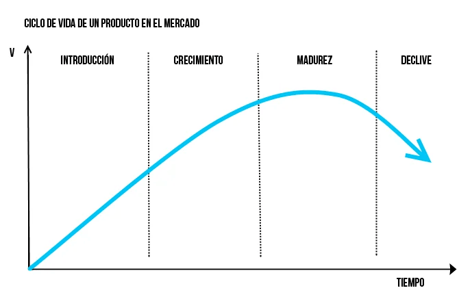

# Tema 1 - Decisiones sobre el producto

**Analizaremos las 4 P's: producto, precio, distribución y comunicación** {>> dixlesia mode ON <<}

## Concepto y naturaleza del producto. Niveles de análisis

- El producto es el **medio** para satisfacer las necesidades de los consumidores.
- Es el punto de partida de la estrategia comercial, la esencia.
- Define el negocio en el que se encuentra la empresa.
- Las decisiones de producto son a largo plazo {>>tienen un largo periodo de maduración<<}

??? example "Un producto puede ser..."
    Un bien, un servicio, una actividad, una experiencia, un evento, una organización, un lugar, una persona, una idea, un comportamiento, etc.

**Producto centrado en las necesidades del consumidor o producto-servicio:** el producto es un conjunto de atributos. Para comparar dos productos diferentes basta con comparar sus atributos. {>>Cuando se lanza un coche, se lanzan múltiples subversiones de ese coche con diferentes atributos<<}

### Noción de producto-servicio

- **Beneficio básico:** ventaja básica por la que se adquiere el producto.
- **Producto genérico:** características téncicas que permiten la prestación de la ^^función básica^^. {>>Versión del producto que incorpora el beneficio básico<<}
- **Producto esperado:** versión del producto que ^^incorpora los atributos, servicios y beneficios adicionales que los compradores habitualmente esperan^^.
- **Producto aumentado:** incorpora los atributos más discriminantes, aquellos que distinguen la oferta de una empresa de la de sus competidores. ==**La competencia se centra en este nivel.**==

### Tipos de productos

#### Según su naturaleza

1. **Bienes (productos tangibles)**. Domina la naturaleza tangible.
    - Consumo frecuente: se destruyen en unos pocos usos.
    - Consumo duradero: uso continuado en el tiempo.
2. **Servicios (productos no tangibles)**. Domina la naturaleza intangible.

!!! example
    - Un restaurante es un **servicio**, porque a pesar de haber ^^elementos tangibles^^ (alimentos) predomina la naturaleza intangible.
    - Un automóvil es un **bien**, porque a pesar de haber ^^elementos intangibles^^ (servicio técnico) predomina la naturaleza tangible.

#### Según su destino o uso

1. **Consumo:** lo compran los consumidores finales
2. **Industrial:** lo compra una organización para incorporarlo a su proceso productivo.

!!! example
    Un mismo producto puede ser de consumo e industrial según su uso: si compro un ordenador para mi casa es de consumo, si lo compra una empresa para sus empleados es industrial.

!!! success "Productos típicos"
    - Hay productos típicamente de consumo: gominolas, paraguas
    - Hay productos típicamente industriales: camión, fresadora

#### Tipos de productos de consumo según su frecuencia y esfuerzo en la compra

- **Conveniencia:** se compran frecuentemente y el esfuerzo que se hace en la compra es mínimo. No piensas mucho para elegir este producto. Son de bajo precio. *Ej: fruta, pan, productos de limpieza.*
    - Corrientes: compra planificada. *Ej: fruta, pescado carne.*
    - Impulso: compra no planificada. *Ej: dulces, flores.*
- **Compra esporádica o comparación:** precio más alto, se usan durante más tiempo. El consumidor compara los precios de muchos productos. *Ej: lavadora, frigorífico.*
- **Especialidad o preferencia:** los productos tienen características únicas. Se asocia la marca a esas características únicas. Sólo quieres comprar el producto de esa marca si tienes la necesidad de comprar ese tipo de producto. *Ej: Iphone*. La empresa puede poner el precio que quiere. {++Las empresas quieren poner su producto aquí.++}
- **No buscados:** se compran con escasa frecuencia y escaso esfuerzo. *Ej: seguro, cementerio*. Las empresas tienen que hacer un alto esfuerzo para convencer a los consumidores, porque a éstos les da lo mismo.

|Características|Conveniencia|Compra esporádica o comparación|Especialidad|
|--|--|--|--|
|Tiempo y esfuerzo dedicado a la compra|muy poco|considerable|el necesario para encontrar la marca deseada|
|Tiempo dedicado a planificar la compra|muy poco|considerable|-|
|Rapidez con la que se satisface la necesidad tras presentarse|Inmediatamente|Largo|-|
|¿Se comparan los precios y la calidad?|No|Sí|No|
|Precio|Generalmente bajo|Generalmente alto|Generalmente alto|
|Frecuencia de la compra|Generalmente frecuente|Poco frecuente|Poco frecuente*|

\* salvo que se trate de un producto de conveniencia que se ha convertido en un producto de preferencia

#### Tipos de productos industriales

- **Materias primas.**
- **Bienes de equipo.** *Ej: maquinaria*
- **Componentes:** inputs intermedios que se pueden identificar. Se pueden identificar en el producto final. *Ej: rueda de un coche*
- **Materiales:** inputs intermedios que no se pueden identificar. Se fusionan con el producto. *Ej: alcohol en un limpiador*
- **Suministros:** ayudan a la fabricación del producto pero no se incorporan al producto. *Ej: material de oficina*
- **Servicios industriales.**

## La cartera de productos

**Al principio la empresa vende sólo un producto, pero realmente las empresas no suelen vender un sólo producto, venden una serie de productos (cartera de productos).**

Razones:

- Adecuarse mejor a las necesidades de cada consumidor. Se sacan versiones ligeramente modificadas del mismo producto.
- Relacionado con la idea de CVP. La empresa debe tener productos en todos los ciclos de vida del producto.
    - Tener productos en diferentes etapas facilita la gestión de las interrelaciones entre los productos.

*[CVP]: Ciclo de Vida del Producto

!!! info "Recordar el ciclo de vida del producto"
    

Si la empresa tiene una cartera de productos deberá tomar decisiones sobre ellos (**mantenerlos**, **modificarlos**, **ampliarlos** y/o **eliminarlos**)

### Líneas de producto

La cartera de productos se divide en líneas de producto.

Una línea de producto es un grupo de productos estrechamente relacionados dentro de la misma categoría.

- **Amplitud de la cartera:** número de líneas de producto de la que consta.
- **Profundidad:** número de productos diferentes de cada línea.
- **Longitud:** número total de productos que conforman la cartera.
- **Consistencia:**
    - ^^Desde el punto de vista del fabricante:^^ utiliza las mismas materias primas, procesos técnicos, distribuidores, etc.
    - ^^Desde el punto de vista del consumidor:^^ los productos que vende son sustitutivos o complementarios.

## Decisiones sobre marcas, envases y etiquetas
