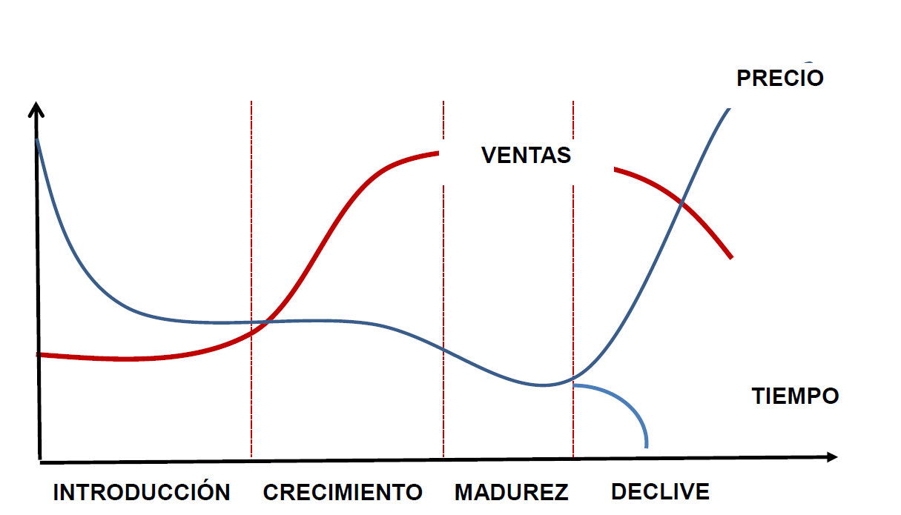

# 2.2. Factores condicionantes, objetivos y estrategias en materia de precios

- Factores **externos** son aquellos que **no** son controlables por parte de la empresa
- Factores **internos** son aquellos que son controlables por parte de la empresa

## Factores externos

### Marco legal y otros factores del macroentorno

En general existe libertad de precios, pero no del todo. Mediante normas, las autoridades tratan de evitar:

- Prácticas abusivas a las que conduce el **monopolio**
- Prácticas lesivas para los intereses de consumidores o competidores
- **Acuerdos entre empresas** para limitar la competencia
- **Competencia desleal**

Otros aspectos del entorno relevantes son:

- La **situación económica** (*recesión vs expansión, tipos de interés...*) {>>No es lo mismo fijar un precio en una época de recesión que en expansión <<}
- **Interés social del producto**

### Estructura competitiva

- La capacidad para fijar el precio depende significativamente de la situación competitiva (*monopolio, oligopolio diferenciado e indiferenciado, competencia perfecta y monopolística...*)
- **El responsable de la política de precios debe ser capaz de antizipar la capacidad de respuesta de la competencia**
- **La eficiencia de un cambio de precio depende de la reacción de los competidores**

|Grado de diferenciación|Uno|Pocos|Muchos|
|:--:|:--:|:--:|:--:|
|:fontawesome-solid-caret-up:|**Monopolio** {: .red}|Oligopolio diferenciado|Competencia monopolística|
|:fontawesome-solid-caret-down:|**Monopolio** {: .red}|Oligopolio indiferenciado|**Competencia perfecta** {: .green}|

### Ciclo de vida del producto

La política de precios se adapta a las etapas del CVP

- **Fase de introducción:** demanda muy inelástica sin competencia → precios altos
- **Etapa de crecimiento y madurez:** aumenta la competencia y la demanda es más elástica → reducción de precios
- **Etapa de declive:** depende de cómo sea la demanda restante → si es inelástica aumenta el precio, si es elástica se reduce el precio

*[CVP]: Ciclo de Vida del Producto

### Demanda

- La sensibilidad de la demanda al precio se mide a partir de la elasticidad → $E_{d,p}=\dfrac{variación\; de\; la\; demanda}{variación\; del\; precio}$
    - **Demanda elástica:** $|E_{d,p}|>1$
    - **Demanda inelástica:** $|E_{d,p}|<1$

- Dificultades para conocer el valor de la elasticidad:
    - **Cambia** con el paso del tiempo
    - **Cambia** con el cambio de etapa del CVP
    - **Cambia** de unos consumidores a otros
