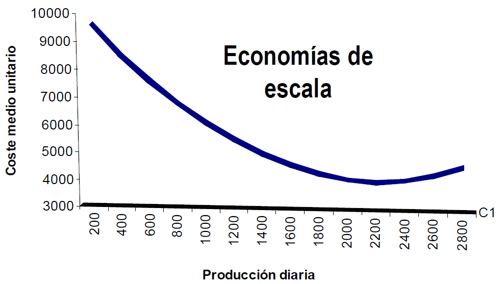
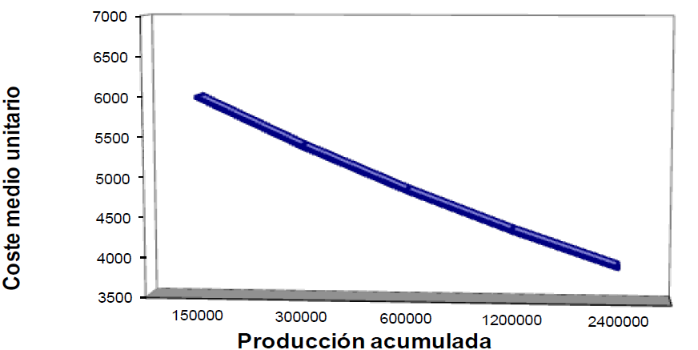

# 2.2. Factores condicionantes, objetivos y estrategias en materia de precios

- Factores **externos** son aquellos que **no** son controlables por parte de la empresa
- Factores **internos** son aquellos que son controlables por parte de la empresa

## Factores externos

### Marco legal y otros factores del macroentorno

En general existe libertad de precios, pero no del todo. Mediante normas, las autoridades tratan de evitar:

- Prácticas abusivas a las que conduce el **monopolio**
- Prácticas lesivas para los intereses de consumidores o competidores
- **Acuerdos entre empresas** para limitar la competencia
- **Competencia desleal**

Otros aspectos del entorno relevantes son:

- La **situación económica** (*recesión vs expansión, tipos de interés...*) {>>No es lo mismo fijar un precio en una época de recesión que en expansión <<}
- **Interés social del producto**

### Estructura competitiva

- La capacidad para fijar el precio depende significativamente de la situación competitiva (*monopolio, oligopolio diferenciado e indiferenciado, competencia perfecta y monopolística...*)
- **El responsable de la política de precios debe ser capaz de anticipar la capacidad de respuesta de la competencia**
- **La eficiencia de un cambio de precio depende de la reacción de los competidores**

|Grado de diferenciación|Uno|Pocos|Muchos|
|:--:|:--:|:--:|:--:|
|:fontawesome-solid-caret-up:|**Monopolio** {: .red}|Oligopolio diferenciado|Competencia monopolística|
|:fontawesome-solid-caret-down:|**Monopolio** {: .red}|Oligopolio indiferenciado|**Competencia perfecta** {: .green}|

### Ciclo de vida del producto

La política de precios se adapta a las etapas del CVP

- **Fase de introducción:** demanda muy inelástica sin competencia → precios altos
- **Etapa de crecimiento y madurez:** aumenta la competencia y la demanda es más elástica → reducción de precios
- **Etapa de declive:** depende de cómo sea la demanda restante → si es inelástica aumenta el precio, si es elástica se reduce el precio

*[CVP]: Ciclo de Vida del Producto

### Demanda

- La sensibilidad de la demanda al precio se mide a partir de la elasticidad → $E_{d,p}=\dfrac{variación\; de\; la\; demanda}{variación\; del\; precio}$
    - **Demanda elástica:** $|E_{d,p}|>1$
    - **Demanda inelástica:** $|E_{d,p}|<1$

- Dificultades para conocer el valor de la elasticidad:
    - **Cambia** con el paso del tiempo
    - **Cambia** con el cambio de etapa del CVP
    - **Cambia** de unos consumidores a otros

### Comportamiento de las partes interesadas

La empresa debe enfrentarse a las reacciones de:

- Competidores
- Intermediarios (*pueden anular los efectos del cambio o imponer un determinado precio*)
- Trabajadores / directivos
- Proveedores (*pueden exigir un cambio paralelo de los precios, depende de su poder de negociación*)
- Acreedores (*pueden cambiarnos el tipo de interés*)
- Sociedad en general

## Factores internos

### Objetivos de la empresa

La empresa puede perseguir múltiples objetivos:

- Maximizar el **beneficio**
- Obtener un determinado **rendimiento** de la **inversión**
- Incrementar la **cuota de mercado**
- Impedir la entrada de **competidores**
- Mantener la situación
- Dotar de una determinada imagen al producto

!!! success "Objetivo"
    Cuanto más claro sea un objetivo, más fácil será alcanzarlo.

!!! example "Ejemplos"
    Si se desea incrementar la cuota el precio deberá ser menor que si se quiere maximizar el beneficio

    La supervivencia supone escoger precios bajos

    **Decremación:** captar las mejores cuotas de mercado, los sectores con más poder de adquisición. Es la estrategia que usan las nuevas empresas; después van a por sectores con menor poder de adquisición.

### Costes

Los costes marcarán el precio mínimo (legalmente está prohibido vender por debajo del precio de coste; a esta práctica se la denomina *"dumping"*)

Como siempre: Costes totales = Costes Fijos + Costes variables

A medida que la empresa adquiere ^^experiencia^^ fabricando u obtiene ^^descuentos por cantidad comprada^^, los costes unitarios de producción tienden a reducirse (efecto [experiencia](#efecto-experiencia) y efecto [escala](#economías-de-escala))

#### Economías de escala

### Efecto experiencia

Cuanto más producto fabrico, menos me cuesta producirlo.

### Variables de marketing-mix y posicionamiento

Las decisiones de precios deben estar coordinadas con el posicionamiento del producto, la distribución y las decisiones de comunicación para crear un marketing coherente para el producto. {>>No puedo vender un Rolex en el rastro <<}

El precio de un producto Debe fijarse teniendo en cuenta el resto de productos de la línea.

Ejemplos:

- El incremento de la **calidad** puede modificar la elasticidad de la demanda al precio
- La **publicidad** puede ayudar a consolidar sin reducción de las ventas una subida del precio
- La **promoción de ventas** exige un precio que la soporte
- La **ausencia de marca** se acompañará de un **precio más bajo**
