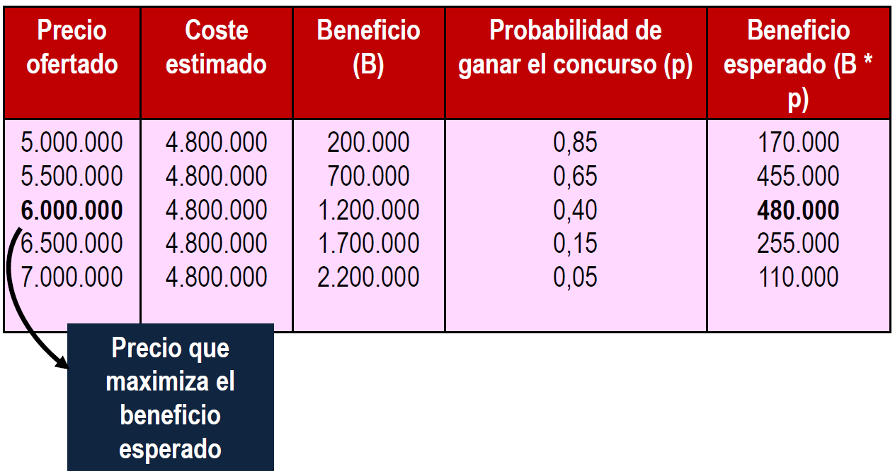

# 2.3. Métodos de fijación y tácticas de precios

El proceso de fijación de precios no se limita a la aplicación de una técnica.

Es un proceso continuo que se inicia con el **establecimiento de unos objetivos generales** en la empresa, pasa por la **aplicación de un procedimiento para su cálculo** y se **extiende más allá del momento en el que se ha determinado el precio**.

## Proceso de fijación de precios

La secuencia de etapas revela:

- La fijación del precio está subordinada a los objetivos de la empresa y a la estrategia de marketing
- Hay que revisar el precio viendo si se han cumplido o no los objetivos propuestos
- Importancia de ^^costes^^, ^^demanda^^ y ^^competencia^^ como condicionantes básicos

### Métodos de fijación de precios

Según el factor en el que se ponga el énfasis:

1. [**Basados en costes**](#métodos-basados-en-los-costes-o-de-precios-internos)
    - Precio límites
    - Precio técnico
    - Precio objetivo
2. [**Basados en la competencia**](#métodos-basados-en-la-competencia)
    - Fijación de precios al nivel corriente
    - Fijación de precios al nivel marcado por el líder
    - Fijación de precios en función del posicionamiento competitivo
    - Licitación o concurso
    - Método del valor percibido
    {: .magenta}
3. **Basados en la demanda**
    - Método del valor percibido
    {: .magenta}
    - Análisis de estabilidad
    - Banda de precios aceptable

**Los métodos no son excluyentes.**

El precio más bajo lo fija el coste del producto y el precio más alto lo fija la demanda (lo que están dispuestos a pagar los consumidores).

Podemos definir el precio en este rango, pero **la competencia condiciona fuertemente la fijación del precio**.

## Métodos basados en los costes (o de precios internos)

- **Precio límite:** permite recuperar el coste variable unitario. **No recupera costes fijos.**
- **Precio técnico:** permite recuperar el coste variable y una parte proporcional de los costes fijos.
- **Precio objetivo:** permite obtener un cierto beneficio.

|Precio|Explicación|Fórmula|
|--|--|--|
|Precio límite|coste variable unitario|$P=c$|
|Precio técnico|coste variable unitario + costes fijos / nivel de actividad|$P=c+CF/Q$|
|Precio objetivo|precio técnico + margen|$P=P_T+margen$|

### Umbral de rentabilidad o punto muerto

El punto muerto se alcanza cuando para una cantidad de productos fabricados los ingresos totales son iguales a los costes. Las ventas por debajo de este precio suponen pérdidas.

**A cada precio de venta corresponde un punto de equilibrio.**
{: .tail}

!!! danger "Suposiciones y limitaciones"
    - ✔️ Los costes fijos son constantes (válido para el corto plazo)
    - ❌ Los costes variables son constantes con respecto a la producción  (no válido)
    - ❌ Incapacidad para determinar si es posible vender esa cantidad

## Métodos basados en la competencia

- **Fijación de precios al nivel corriente:** precio similar al precio medio de los productos de la competencia
- **Fijación de precios al nivel marcado por el líder:** mercados oligopolístocs y con poca diferenciación, donde existe un líder claro
- **Fijación de precios en función del posicionamiento competitivo**
    - Precios elevados
    - Precios bajos
- **Caso particular: [licitación o concurso](#licitación-o-concurso):** adjudicaciones públicas para conseguir un contrato

### Licitación o concurso

Gana el concurso la empresa que fije el mejor precio siempre que se cumplan las condiciones estipuladas.

Método del valor esperado {>>ofrece un apoyo a la decisión de fijación del precio para empresas que optan a muchos recursos<<}

^^En el cálculo de $p$ reside la dificultad de la fijación de precios para una licitación. La experiencia del responsable de la fijación de precios en licitaciones pasadas determinará un mejor ajuste de esta probabilidad.^^

### Análisis de la elasticidad

Factores condicionantes:

- Originalidad y grado de diferenciación del producto (*inelástica*)
- Existencia de productos sustituibles (*elástica*)
- Posibilidad de comparar los productos en términos de calidad
- Importancia relativa del gasto
- Precio efectivamente pagado por el comprador respecto al coste total
- Carácter complementario del producto respecto a otro previamente adquirido
- Efecto de la relación precio-calidad percibida
- Posibilidad de almacenamiento del producto
- Existencia de precios de referencia

### Método de la banda de precios aceptable

### Fijación de la banda de precios aceptable

## Método del valor percibido

Estrategias precio y calidad

Tácticas sobre precios

Precios psicológicos

## Adaptaciones del precio

### Precios promocionales

### Discriminación de precios

### Precios para un conjunto de productos
