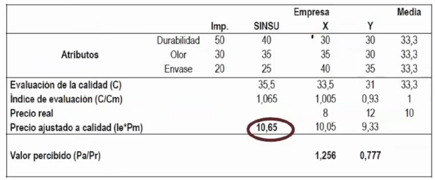
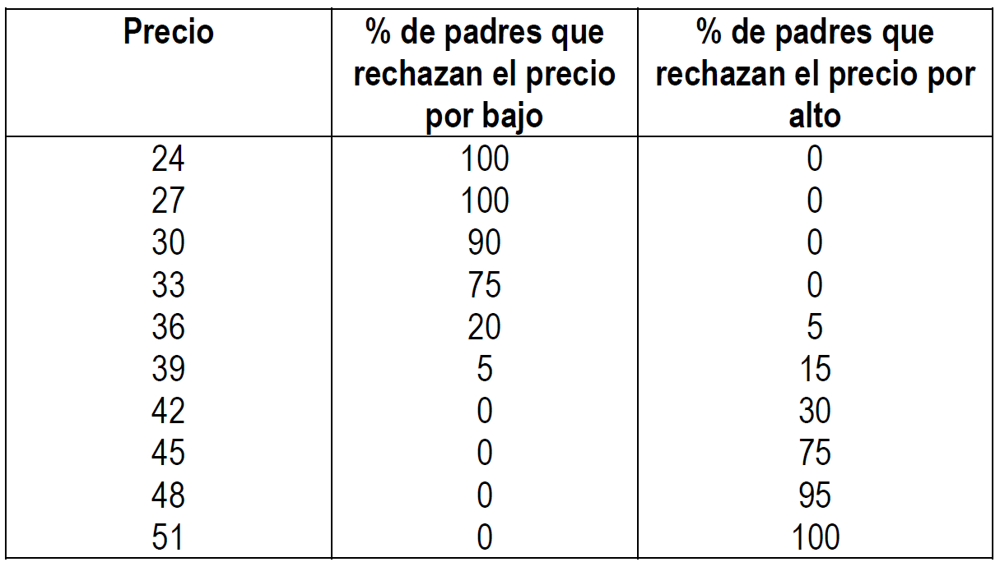

# Problemas tema 2

## `Problema 1`

Una pequeña empresa dedicada a la producción de cordones de diseño para zapatos y zapatillas ha estimado que el coste variable es de $20$ u.m. por unidad. Estudios empíricos realizados han estimado que la demanda anual tiene la siguiente ecuación ($Q$ representa a la demanda y $p$ al precio): $Q = 196.000- 360p$. El director de marketing necesita saber que precio permite maximizar el beneficio anual, si el coste fijo anual es de $200.000$ u.m. **Determine el umbral de rentabilidad para esta empresa.**

Datos:

- $CV_U=20$
- $Q=196.000-360p$
- $CF=200.000$

$BAII=Qp-CV\cdot Q-CF=(196.000-360p)p-20(196.000-360p)-200.000$

$BAII=-360p^2+203.200p-4.120.000$

Beneficio máximo: $\dfrac{dBAII}{dp}=-720p+203.200=0→p=282,2$

Umbral de rentabilidad: $Qp=Q\cdot CV+CF→Q=\dfrac{CF}{p}-CF_U=\dfrac{200.000}{282.2}-20=762,7$

**No calcular el umbral de rentabilidad directamente resolviendo la ecuación con la calculadora, sale mal.**
{.red}

## `Problema 2`

La empresa PIP desea fijar los precios de sus productos basándose en el coste. Se sabe que los costes fijos totales de la empresa ascienden a $3.000.000$ u.m., la producción y demanda es de $5.000$ unidades, el coste unitario variable es de $1.000$ u.m. Con esta información, **calcule el precio límite**, **el precio técnico** y **el precio objetivo** si la empresa desea obtener un beneficio por unidad de $1.000$ u.m. **¿Con qué precio conseguiría la empresa maximizar los ingresos totales?** **¿Con que precio conseguirá maximizar el beneficio?** La función de demanda de la empresa respecto al precio es la siguiente: $Q=2.700-p$ (siendo $Q$=demanda y $p$=precio).

Datos:

- $CV_U=1.000$
- $Q=5.000$
- $CF=3.000.000$
- $Q=2.700-p$

### 1. Precios

- **Precio límite:** $1.000$
- **Precio técnico:** $1.000+\dfrac{3.000.000}{5.000}=1.600$
- **Precio objetivo:** $2.600$

### 2. Maximización de ingresos

$I=(2.700-p)p=2.700p-p^2$

$\dfrac{dI}{dp}=2.700-2p=0→p=1.350$

### 3. Maximización de beneficios

$BAII=(2.700-p)p-1.000(2.700-p)-3.000.000$

$BAII=-p^2+3.700p-5.700.000$

$\dfrac{dBAII}{dp}=-2p+3.700=0→p=1.850$

## `Problema 3`

Una empresa desea determinar el precio de venta de sus dos variedades de cervezas, con y sin alcohol, denominadas `CON` y `SIN`, respectivamente. Esta empresa produce $60.000$ litros de `CON` y $80.000$ de `SIN`. La empresa tiene unos costes fijos anuales de $4.000.000$ u.m. y los costes variables unitarios son de $100$ u.m. para la `CON` y $90$ u.m. para la `SIN`. Determinar el precio de venta si el objetivo perseguido por la empresa es obtener un margen de beneficio unitario sobre el precio de coste del 20% para la `CON` y del 15% para la `SIN`. Distribuya los costes fijos utilizando la proporción que corresponde a cada producto sobre el total de costes variables.

Calculamos la proporción de costes fijos de `CON`:

$CON_\%=\dfrac{60.000\cdot100}{60.000\cdot100+80.000\cdot90}=45,45\%$

|Cerveza|%|CF|CV|CT|CT/Q|
|--|--|--|--|--|--|
|`CON`|45.45%|1.820.000|6.000.000|7.820.000|130,33|
|`SIN`|54.54$|2.180.000|7.200.000|9.380.000|117,25|

$P_{CON}=1.2\cdot130,33=156,39$ 
$P_{SIN}=1.2\cdot117,25=134.83$

## `Problema 4`

Con los datos siguientes, capital invertido = $150.000$ u.m., tasa de rentabilidad = 15% sobre el capital invertido, coste variable unitario = $8$ u.m. y coste fijo del período = $45.000$ u.m., determine los precios internos (límite, técnico y objetivo) para los diferentes supuestos sobre el nivel de actividad.

- Hipótesis pesimista: $500$ unidades
- Hipótesis más probable: $750$ unidades
- Hipótesis optimista: $1000$ unidades

$BAII=150.000\cdot 15\%=22.500$

|Nivel de actividad|CF|CV|CT|BAII|Ingresos|
|--|--|--|--|--|--|
|500|45.000|4.000|49.000|22.500|71.500|
|750|45.000|6.000|51.000|22.500|73.500|
|1.000|45.000|8.000|53.000|22.500|75.500|

$Margen_\%=BAII/Q$

|Nivel de actividad|Precio límite|Precio técnico|Precio objetivo|
|--|--|--|--|
|500|8|$8+45.000/500=98$|143|
|750|8|$8+45.000/750=68$|98|
|1.000|8|$8+45.000/1.000=53$|75,5|

## `Problema 5`

Una empresa acude a un concurso para realizar una obra cuyo coste se estima en diez millones. La probabilidad de conseguir el contrato varía entre un máximo de $0,99$, para un precio de $10.000.000$, y un mínimo de $0,10$ para un precio de $15.000.000$. El resto de probabilidades se muestran en la tabla siguiente.

**Determine que oferta reporta a la empresa un mayor beneficio esperado y qué beneficio real obtendría si consigue que le adjudiquen el concurso.**

Añadimos una columna a la tabla (`Beneficio esperado = Beneficio * Probabilidad`):

|Precio de la oferta|Beneficio esperado =  Beneficio \* Probabilidad|
|--|--:|
|10.000.000|0|
|11.000.000|850.000|
|12.000.000|**1.300.000**{.green}|
|13.000.000|1.200.000|
|14.000.000|800.000|
|15.000.000|500.000|

La mejor oferta es la que más beneficio esperado nos da: $12.000.000$ 
El beneficio real es el beneficoi de la propia oferta: $2.000.000$

## `Problema 6`

Una empresa fabricante de maquinaria herramienta para el cuidado de jardines ha sido invitada a participar en un concurso público organizado por la Unión Europea. La empresa sabe que junto con ella ha sido también invitada la empresa competidora, Rentamax. Después de un estudio cuidadoso de las bases, prepara tres planes alternativos de oferta que podría presentar, con tres niveles de precios que le proporcionan, obviamente, diferentes beneficios. Gracias a otras licitaciones pasadas, la empresa puede determinar la probabilidad que tendría de ganar el concurso si presentara cada uno de los precios seleccionados, que se incluyen a continuación junto con los probables beneficios. ¿Qué plan de los tres deberá presentar?

||Precio de la oferta|Beneficio|Probabilidad de ganar|Ben. Esp.|
|--|:--:|:--:|:--:|:--:|
|Plan A|7.000|1.000|0,90|900|
|Plan B|8.000|2.000|0,75|1.500|
|Plan C|10.000|4.000|0,25|1.000|

La mejor opción es el plan B (tiene un mayor beneficio esperado). El beneficio real sería $2.000$

## `Problema 7`

Con la siguiente lista de precios: $0$, $5.000$, $10.000$, $15.000$, $20.000$ y $25.000$ u.m., la empresa SOSAN realizó una investigación de mercados para conocer cuál es aproximadamente la banda de precios aceptable y el precio que goza de mayor aceptación. Se sabe que los precios de $5.000$ u.m. y $25.000$ u.m. los rechazaría toda la muestra, el primero por ser muy bajo y el segundo por ser muy alto. El 60% aceptan el precio de $10.000$ u.m., el 75% el de $15.000$ u.m y el de $20.000$ u.m. lo acepta el 85% por no tener un precio excesivamente bajo. Por otro lado, el 20% manifiesta que rechazaría un precio de $10.000$ u.m, el 25% rechazaría el de $15.000$ u.m y un 40% el de $20.000$ u.m., en este caso por ser excesivamente alto.

- A: porcentaje de rechazo por precio excesivamente **alto**
- B: porcentaje de rechazo por precio excesivamente **bajo**

|P|B|A|Niv. Acept. (1-B-A)|
|--|:--:|:--:|:--:|
|0|100%|0%|0%|
|5.000|**100%**{.magenta}|0%|0%|
|10.000|**40%**{.magenta}|20%|40%|
|15.000 {.green}|25% {.green}|25% {.green}|50% {.green}|
|20.000|15%|**40%**{.magenta}|45%|
|25.000|0%|**100%**{.magenta}|0%|

Para escoger al mínimo buscamos qué precio tendría un nivel de aceptación del 50% por ser bajo:

$$
\begin{align*}
& |10.000-5.000| \,\rule[2.5pt]{16pt}{0.5pt}\, |40-60|\\
& |10.000-\;\;\;x\;\;\;| \,\rule[2.5pt]{16pt}{0.5pt}\, |40-50|
\end{align*}
$$

$\dfrac{500\cdot10}{60}=10.000-x→x=9.166,67$

Para escoger al máximo buscamos qué precio tendría un nivel de aceptación del 50% por ser alto:

$$
\begin{align*}
& |25.000-20.000| \,\rule[2.5pt]{16pt}{0.5pt}\, |100-40|\\
& |25.000-\;\;\;\;x\;\;\;\;| \,\rule[2.5pt]{16pt}{0.5pt}\, |100-50|
\end{align*}
$$

$x=20.833,33$

**¿Qué precio fijaríamos?** 15.000

## `Problema 8`

La empresa SINSU quiere conocer cuál es el precio más adecuado para un nuevo desodorante que va a lanzar al mercado. Para la determinación de tal precio, se fija en dos empresas competidoras, X e Y, que actualmente venden sus respectivas marcas a un precio de 8 y 12 euros, respectivamente. La empresa valora con una importancia relativa de 0,5, 0,3 y 0,2 los atributos durabilidad, olor y envase. La puntuación dada por la muestra elegida a cada atributo para cada desodorante es la siguiente:

**Calcule:**

1. El precio que se ajusta a la calidad percibida de la marca SINSU de desodorante
2. El precio con el que la empresa SINSU igualaría o superaría el valor percibido por los consumidores para la marcas X e Y.

|Atributo|Importancia|Media|
|--|--|
|Durabilidad|0.5|0.33|
|Olor|0.3|0.33|
|Envase|0.2|0.33|

- Evaluación de calidad: sumar cada atributo por su importancia relativa
- Índice de evaluación: evaluación de la calidad / media de la evaluación de la calidad
- Precio ajustado a calidad: Índice de evaluación \* media de los precios
- Valor percibido: Precio ajustado / Precio real

Para nuestra marca podemos fijal un valor percibido (mayor o igual al resto de valores percibidos) y calculamos el precio real

Precio con el que igualaría o superaría el valor percibido de X e Y: $10,65/1,256=8,49$

## `Problema 10`

Para la próxima temporada, CKIDS pretende comercializar polos de elevada calidad. Se sabe que los dos competidores más directos (A y B) fijan un precio para los polos de 34 u.m. y 37 u.m. respectivamente. Con el fin de establecer el precio más adecuado para los nuevos polos, se ha realizado un estudio de mercado entre los padres, obteniéndose los siguientes resultados.

Además, los responsables de marketing han valorado la calidad de las marcas A y B con 96 y 100 puntos, respectivamente. Cuál será el precio más adecuado y los precios máximos y mínimo para el polo según el método de la banda de precios aceptable? ¿Sería este precio el más adecuado para que sea la marca de mejor relación calidad-precio según el método del valor percibido, si se sabe que se ha valorado la calidad de sus polos con 97 puntos?

|Precio|B|A|Niv. Acept.|
|24|100|0|0|
|27|100|0|0|
|30|90|0|10|
|33|**75**{.magenta}|0|25|
|36|**20**{.magenta}|5|75|
|**39**{.green}|**5**{.green}|**15**{.green}|**80**{.green}|
|42|0|**30**{.magenta}|70|
|45|0|**75**{.magenta}|25|
|48|0|95|5|
|51|0|100|0|

Banda de precios aceptable: entre 34,5 y 43,5

El precio más aceptado haría la relación más desfavorable: $35,252/29=0,904$ 
Para ser la marca de mayor valor percibido: $35,252/1,026=34,359$
