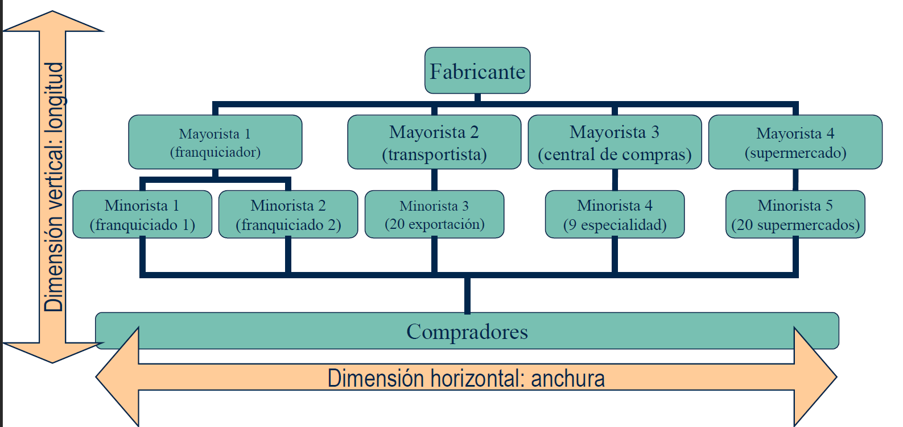
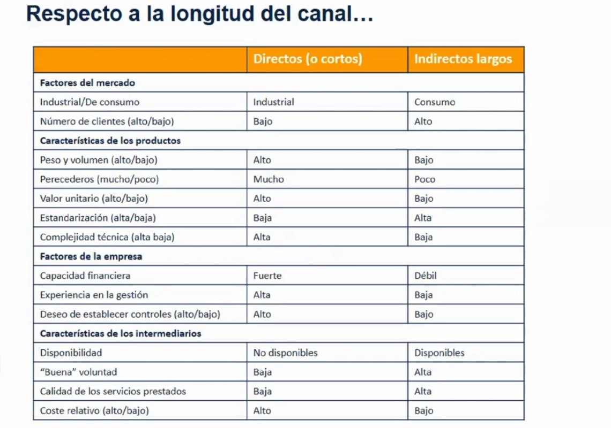

# 3.1. La distribución comercial y los canales de distribución

**Objetivo:** hacer pasar los bienes y servicios terminados del estado de producción al estado de consumo.

^^Función de la distribución dentro del sistema económico^^: reducir las disparidades entre oferta y demanda → [valor añadido de la distribución](#valor-añadido-de-la-distribución)

## Valor añadido de la distribución

1. ^^Utilidad de lugar^^: *no tengo que ir a colombia a por café*
2. ^^Utilidad de tiempo^^: *no es problema la diferencia temporal entre la producción y el consumo o el problema se reduce*
3. ^^Utilidad de estado^^: *si no quiero un jamón entero puedo comprar 50 gramos*

## Funciones de la distribución comercial

- Negociación
- Almacenaje
- Surtido y organización de la oferta
- Financiación y otros servicios
- Transporte
- Contactos
- Información
- Asumir riesgos

Estas funciones generan las [utilidades](#valor-añadido-de-la-distribución).

## Flujos comerciales en las actividades de distribución

## El canal de distribución

Conjunto de personas y organizaciones que participan en las actividades de distribución impulsando el flujo de bienes y servicios desde su punto de origen hasta su punto de venta o consumo

- Productores
- Intermediarios {>>No son necesarios, pero suele haberlos<<}
- Compradores

### Ventajas

- **Reducción del número de contactos**
- Economías de escala
- Mejor surtido/servicio

Todo esto provoca que los fabricantes se especialicen

## Estructura de los canales de distribución

Dimensión del canal de distribución

- Vertical: longitud del canal
- Horizontal: anchura del canal

**Tipos de canales según su longitud:**

- ^^Canales directos:^^ no hay intermediarios. {>> Productos perecederos alimenticios con volumen de ventas bajo / Productos no perecederos sin cantidad limitante <<}
- ^^Canales indirectos cortos:^^ hay 1 intermediario {>> Productos de consumo duradero <<}
- ^^Canales indirectos largo:^^ hay más de 1 intermediario {>> Nivel 2: Productos de compra frecuente / Nivel = 3: Productos alimenticios (sobre todo los que se importan, que pueden tener hasta 4 o 5 niveles) <<}

!!! question "Nivel"
    Nivel X = X intermediarios

**Tipos de distribución según su anchura:**

- ^^Distribución intensiva:^^ queremos tener el número de puntos de venta posibles. Garantizamos una cobertura total, mayor volumen de ventas y una mayor cuota de mercado. Mayor coste. Se puede perder el control. Peor imagen de marca. {>>(Cocacola) / Productos de compra corriente<<}
- ^^Distribución selectiva:^^ menor coste que la distribución intensiva alcanzando un nivel de cobertura aceptable. Mayor nivel de cooperación con los intermediarios y más control sobre la políticas de marketing mix. Si limitamos demasiado podemos no alcanzar una cobertura adecuada. Puede resultar de una elección forzosa (impuesto por el distribuidor) {>>Muebles, electrodomésticos<<}
- ^^Distribución exclusiva:^^ sólo ciertos distribuidores tienen el derecho **exclusivo** de vender la marca. Ventajas: máximo control en la política de marketing mix, máxima cooperación con los distribuidores. Inconvenientes: cobertura ineficiente, puede resultar de una elección forzosa. {>>Productos de especial calidad y prestigio<<}

!!! example "Nike"
    - **Canal indirecto largo** porque nike no va a contactar con cada cliente personalmente.
    - **Distribución selectiva** porque no va a estar en todas las tiendas, pero tampoco va a estar en cuatro contadas.

## Factores relevantes en la configuración del canal

- **Características del mercado**
    - Industrial: canales cortos
    - Consumo: canales largos
- **Características de los productos**
    - Compra frecuente (bienes de conveniencia): distribución intensiva
    - Compra esporádica: distribución selectiva
    - Bienes de especialidad: distribución selectiva o exclusiva
- **Características de la empresa**
- **Características de los intermediarios**

